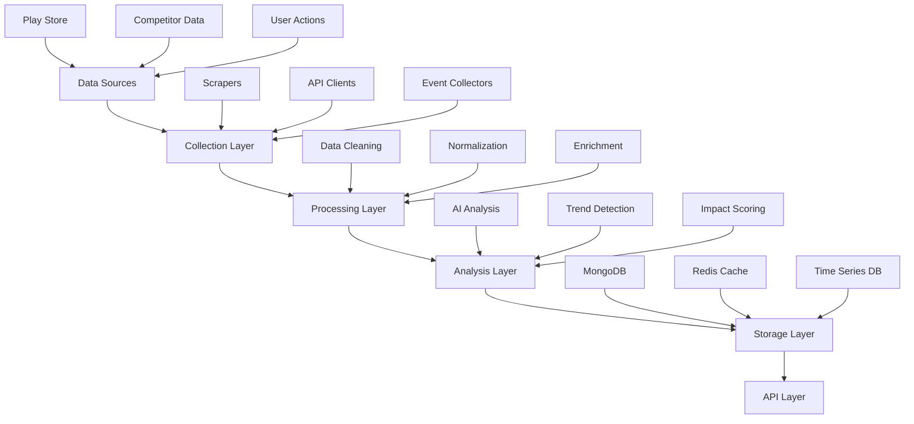

# ASO Tool Data Pipeline Redesign

## TLDR
- Real-time data processing
- Efficient caching strategy
- Scalable architecture
- Error resilience

## Pipeline Overview



## Data Collection

### 1. Play Store Scraper
```python
class PlayStoreCollector:
    def __init__(self):
        self.scraper_pool = ScraperPool(size=10)
        self.rate_limiter = RateLimiter(
            max_requests=100,
            time_window=60
        )
    
    async def collect_app_data(
        self,
        package_name: str
    ) -> AppData:
        async with self.rate_limiter:
            return await self.scraper_pool.scrape(
                package_name
            )
    
    async def collect_rankings(
        self,
        keywords: List[str]
    ) -> List[Ranking]:
        results = []
        async for keyword in AsyncIterator(keywords):
            async with self.rate_limiter:
                ranking = await self.scraper_pool.search(
                    keyword
                )
                results.append(ranking)
        return results
```

### 2. Event Collection
```python
class EventCollector:
    def __init__(self):
        self.queue = AsyncQueue()
        self.processor = EventProcessor()
    
    async def collect_event(self, event: Event):
        await self.queue.put(event)
        
    async def process_events(self):
        while True:
            event = await self.queue.get()
            try:
                await self.processor.process(event)
            except Exception as e:
                await self.handle_error(e, event)
            finally:
                self.queue.task_done()
```

## Data Processing

### 1. Data Cleaning
```python
class DataCleaner:
    async def clean_app_data(
        self,
        data: AppData
    ) -> CleanAppData:
        return await self.remove_invalid_chars(
            await self.normalize_text(
                await self.validate_fields(data)
            )
        )
    
    async def clean_rankings(
        self,
        rankings: List[Ranking]
    ) -> List[CleanRanking]:
        return [
            await self.validate_ranking(r)
            for r in rankings
        ]
```

### 2. Data Enrichment
```python
class DataEnricher:
    def __init__(self):
        self.ai_client = DeepseekClient()
        
    async def enrich_app_data(
        self,
        data: CleanAppData
    ) -> EnrichedAppData:
        sentiment = await self.analyze_sentiment(
            data.description
        )
        keywords = await self.extract_keywords(
            data.description
        )
        return EnrichedAppData(
            **data.dict(),
            sentiment=sentiment,
            keywords=keywords
        )
```

## Analysis Layer

### 1. Trend Analysis
```python
class TrendAnalyzer:
    def __init__(self):
        self.time_series_db = TimeSeriesDB()
        
    async def analyze_ranking_trends(
        self,
        app_id: str,
        timeframe: TimeFrame
    ) -> TrendAnalysis:
        data = await self.time_series_db.get_rankings(
            app_id,
            timeframe
        )
        return await self.calculate_trends(data)
    
    async def calculate_trends(
        self,
        data: TimeSeriesData
    ) -> TrendAnalysis:
        return {
            'direction': self.get_trend_direction(data),
            'velocity': self.calculate_velocity(data),
            'seasonality': self.detect_seasonality(data),
            'predictions': await self.predict_future(data)
        }
```

### 2. Impact Analysis
```python
class ImpactAnalyzer:
    def __init__(self):
        self.ai_model = DeepseekModel()
        
    async def analyze_change_impact(
        self,
        current_state: AppState,
        proposed_changes: Changes
    ) -> ImpactAnalysis:
        return await self.ai_model.predict_impact(
            current_state,
            proposed_changes
        )
```

## Storage Layer

### 1. Caching Strategy
```python
class CacheManager:
    def __init__(self):
        self.redis = Redis()
        self.cache_config = {
            'rankings': 300,  # 5 minutes
            'analysis': 1800,  # 30 minutes
            'metadata': 3600   # 1 hour
        }
    
    async def get_or_compute(
        self,
        key: str,
        compute_func: Callable,
        ttl: Optional[int] = None
    ):
        if cached := await self.redis.get(key):
            return cached
            
        result = await compute_func()
        await self.redis.set(
            key,
            result,
            ex=ttl or self.cache_config.get(
                key.split(':')[0],
                300
            )
        )
        return result
```

### 2. Data Persistence
```python
class DataStore:
    def __init__(self):
        self.mongo = MongoDB()
        self.time_series = TimeSeriesDB()
        
    async def store_rankings(
        self,
        rankings: List[Ranking]
    ):
        await self.time_series.store_rankings(rankings)
        await self.mongo.store_latest_rankings(rankings)
    
    async def store_analysis(
        self,
        analysis: Analysis
    ):
        await self.mongo.store_analysis(analysis)
```

## Pipeline Optimization

### 1. Batch Processing
```python
class BatchProcessor:
    def __init__(self, batch_size: int = 100):
        self.batch_size = batch_size
        self.queue = []
        
    async def add(self, item: Any):
        self.queue.append(item)
        if len(self.queue) >= self.batch_size:
            await self.process_batch()
            
    async def process_batch(self):
        batch = self.queue[:self.batch_size]
        self.queue = self.queue[self.batch_size:]
        await self.process_items(batch)
```

### 2. Rate Limiting
```python
class RateLimiter:
    def __init__(
        self,
        max_requests: int,
        time_window: int
    ):
        self.max_requests = max_requests
        self.time_window = time_window
        self.requests = []
        
    async def __aenter__(self):
        while len(self.requests) >= self.max_requests:
            cutoff = time.time() - self.time_window
            self.requests = [
                r for r in self.requests
                if r > cutoff
            ]
            if len(self.requests) >= self.max_requests:
                await asyncio.sleep(1)
        self.requests.append(time.time())
        
    async def __aexit__(self, *args):
        pass
```

## Error Handling

### 1. Retry Mechanism
```python
class RetryHandler:
    def __init__(
        self,
        max_retries: int = 3,
        backoff_factor: float = 1.5
    ):
        self.max_retries = max_retries
        self.backoff_factor = backoff_factor
        
    async def retry(
        self,
        func: Callable,
        *args,
        **kwargs
    ):
        retries = 0
        while retries < self.max_retries:
            try:
                return await func(*args, **kwargs)
            except Exception as e:
                retries += 1
                if retries == self.max_retries:
                    raise
                await asyncio.sleep(
                    self.backoff_factor ** retries
                )
```

### 2. Error Recovery
```python
class ErrorRecovery:
    def __init__(self):
        self.error_queue = AsyncQueue()
        
    async def handle_error(
        self,
        error: Exception,
        context: Dict
    ):
        await self.error_queue.put({
            'error': error,
            'context': context,
            'timestamp': datetime.utcnow()
        })
        
    async def process_errors(self):
        while True:
            error = await self.error_queue.get()
            try:
                await self.recover(error)
            except Exception as e:
                await self.escalate_error(e, error)
            finally:
                self.error_queue.task_done()
```

## Monitoring

### 1. Performance Monitoring
```python
class PipelineMonitor:
    def __init__(self):
        self.metrics = MetricsCollector()
        
    async def track_performance(
        self,
        operation: str,
        start_time: float
    ):
        duration = time.time() - start_time
        await self.metrics.record_duration(
            operation,
            duration
        )
        
    async def track_error(
        self,
        operation: str,
        error: Exception
    ):
        await self.metrics.record_error(
            operation,
            error
        )
```

### 2. Health Checks
```python
class HealthChecker:
    def __init__(self):
        self.services = {
            'scraper': PlayStoreCollector(),
            'processor': DataProcessor(),
            'storage': DataStore()
        }
        
    async def check_health(self) -> Dict[str, bool]:
        return {
            name: await service.is_healthy()
            for name, service in self.services.items()
        }
```

## Scaling Strategy

### 1. Horizontal Scaling
```python
class ScalingManager:
    def __init__(self):
        self.load_balancer = LoadBalancer()
        
    async def scale_collectors(
        self,
        load: float
    ):
        if load > 0.8:
            await self.load_balancer.add_collector()
        elif load < 0.2:
            await self.load_balancer.remove_collector()
```

### 2. Load Distribution
```python
class LoadBalancer:
    def __init__(self):
        self.collectors = []
        
    async def distribute_work(
        self,
        tasks: List[Task]
    ):
        chunks = self.split_tasks(tasks)
        return await asyncio.gather(*[
            collector.process(chunk)
            for collector, chunk
            in zip(self.collectors, chunks)
        ])
```