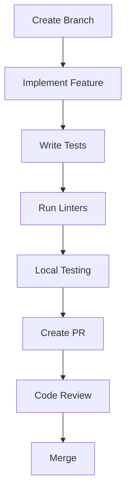

# ASO Tool Development Guide

## TLDR
- Tech Stack: FastAPI + React + MongoDB
- Development: Docker-based
- Testing: Pytest + React Testing Library
- CI/CD: GitHub Actions

## Quick Start
```bash
# Clone repository
git clone https://github.com/ManmohanBuildsProducts/aso-tool.git
cd aso-tool

# Start development environment
docker-compose up -d

# Install dependencies
poetry install  # Backend
yarn install    # Frontend

# Run tests
pytest tests/   # Backend
yarn test       # Frontend
```

## Development Environment

### Prerequisites
```bash
# Required tools
- Docker & Docker Compose
- Python 3.11+
- Node.js 18+
- Poetry
- Yarn
```

### Environment Setup
```bash
# Backend environment
cp .env.example .env
poetry shell
poetry install

# Frontend environment
cd frontend
cp .env.example .env
yarn install
```

### Running Locally
```bash
# Backend (FastAPI)
poetry run uvicorn backend.server:app --reload --port 55240

# Frontend (React)
cd frontend
yarn start

# MongoDB
docker-compose up mongodb -d
```

## Project Structure
```
/app
├── backend/
│   ├── server.py           # Main FastAPI application
│   ├── aso_analyzer.py     # ASO analysis logic
│   ├── keyword_analyzer.py # Keyword analysis
│   ├── ranking_analyzer.py # Ranking analysis
│   └── metadata_optimizer.py # Metadata optimization
├── frontend/
│   ├── src/
│   │   ├── components/     # React components
│   │   ├── hooks/         # Custom hooks
│   │   ├── services/      # API services
│   │   └── utils/         # Utility functions
│   └── public/
├── tests/
│   ├── test_aso_analyzer.py
│   ├── test_integration.py
│   └── test_api.py
└── docs/
```

## Development Workflow

### 1. Feature Development


### 2. Testing Strategy
```typescript
// Unit Tests
- Backend: pytest
- Frontend: Jest + React Testing Library
- Coverage target: 80%

// Integration Tests
- API endpoints
- Component integration
- Database operations

// E2E Tests
- User flows
- Critical paths
- Performance tests
```

### 3. Code Quality
```bash
# Backend
poetry run black backend/
poetry run isort backend/
poetry run flake8 backend/
poetry run mypy backend/

# Frontend
yarn lint
yarn format
```

## Testing

### Backend Tests
```python
# Run all tests
pytest

# Run with coverage
pytest --cov=backend

# Run specific test
pytest tests/test_aso_analyzer.py

# Run with logging
pytest -v --log-cli-level=INFO
```

### Frontend Tests
```bash
# Run all tests
yarn test

# Run with coverage
yarn test --coverage

# Run specific test
yarn test src/components/HealthScore.test.js

# Watch mode
yarn test --watch
```

### Integration Tests
```bash
# Run API tests
pytest tests/test_integration.py

# Run E2E tests
yarn cypress run
```

## Deployment

### Local Deployment
```bash
# Build containers
docker-compose build

# Start services
docker-compose up -d

# Check logs
docker-compose logs -f
```

### Production Deployment
```bash
# Build production images
docker-compose -f docker-compose.prod.yml build

# Deploy
docker-compose -f docker-compose.prod.yml up -d

# Monitor
docker-compose -f docker-compose.prod.yml logs -f
```

## CI/CD Pipeline

### GitHub Actions
```yaml
name: CI/CD

on:
  push:
    branches: [ master ]
  pull_request:
    branches: [ master ]

jobs:
  test:
    runs-on: ubuntu-latest
    steps:
      - uses: actions/checkout@v2
      - name: Run tests
        run: |
          poetry install
          pytest

  deploy:
    needs: test
    runs-on: ubuntu-latest
    steps:
      - uses: actions/checkout@v2
      - name: Deploy
        run: |
          docker-compose -f docker-compose.prod.yml up -d
```

## Version Control

### Branch Strategy
```
master           # Production code
├── develop      # Development code
├── feature/*    # New features
├── bugfix/*     # Bug fixes
└── release/*    # Release branches
```

### Commit Convention
```
feat: Add new feature
fix: Bug fix
docs: Documentation changes
style: Code style changes
refactor: Code refactoring
test: Add/update tests
chore: Maintenance tasks
```

## Performance Optimization

### Backend
1. Database
   - Index optimization
   - Query optimization
   - Connection pooling
   - Caching strategy

2. API
   - Response compression
   - Rate limiting
   - Batch processing
   - Async operations

### Frontend
1. React
   - Code splitting
   - Lazy loading
   - Memoization
   - Virtual scrolling

2. Build
   - Bundle optimization
   - Tree shaking
   - Asset optimization
   - Cache management

## Monitoring

### Application Metrics
```typescript
interface Metrics {
  api_latency: number;
  error_rate: number;
  active_users: number;
  memory_usage: number;
}
```

### Logging
```python
# Backend logging
logging.info("API request received", extra={
    "endpoint": "/api/analyze",
    "method": "GET",
    "duration": 123
})

# Frontend logging
console.log("Component rendered", {
    component: "HealthScore",
    props: props,
    duration: performance.now() - startTime
})
```

## Best Practices

### Code Style
1. Backend (Python)
   - PEP 8 compliance
   - Type hints
   - Docstrings
   - Error handling

2. Frontend (React)
   - ESLint rules
   - TypeScript
   - Component patterns
   - Error boundaries

### Security
1. API Security
   - Authentication
   - Rate limiting
   - Input validation
   - CORS policy

2. Data Security
   - Encryption
   - Access control
   - Data validation
   - Audit logging

### Documentation
1. Code Documentation
   - Function docs
   - Type definitions
   - Example usage
   - Edge cases

2. API Documentation
   - OpenAPI/Swagger
   - Request/response examples
   - Error codes
   - Authentication