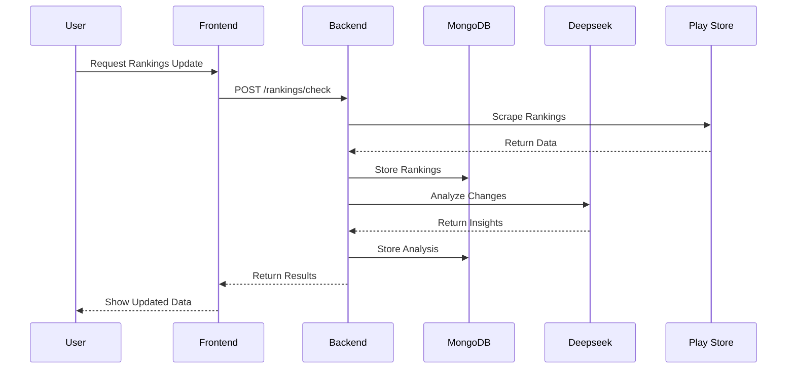
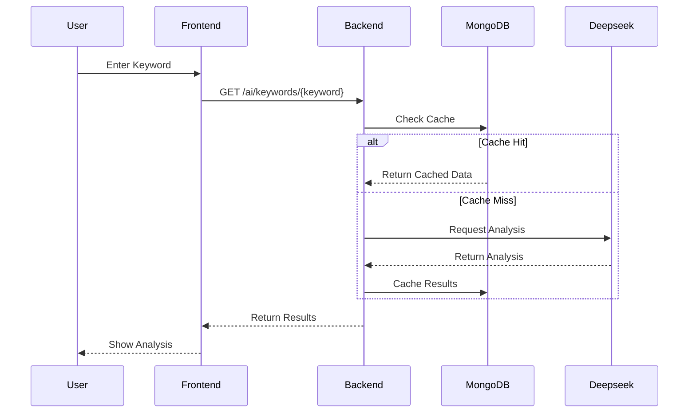
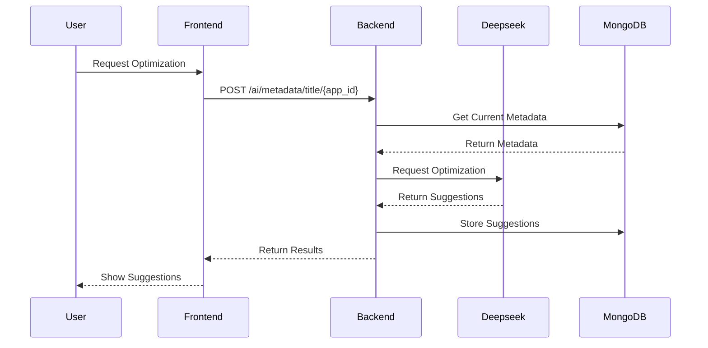
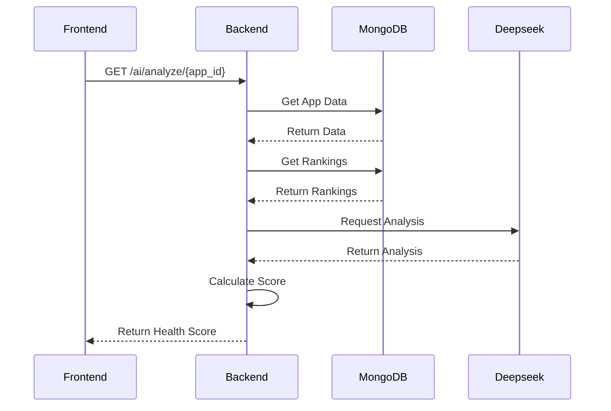
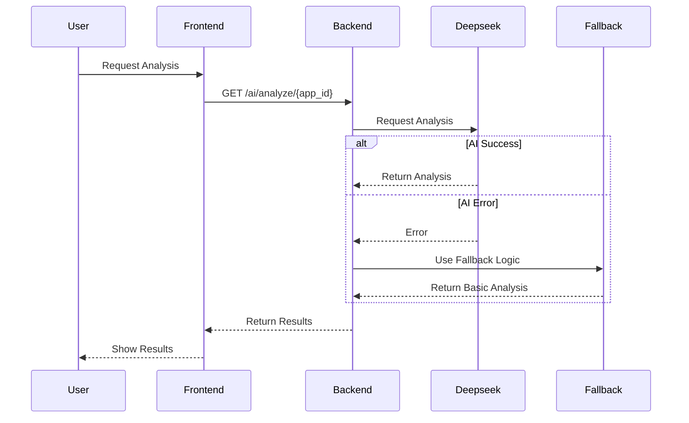
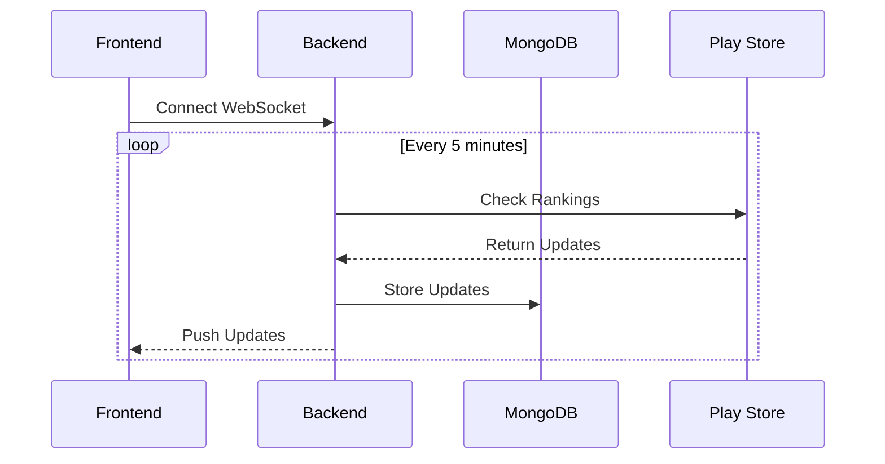

# ASO Tool Technical Sequences

## TLDR
- Shows detailed component interactions
- Covers main user flows
- Includes error handling
- Documents async operations

## Ranking Update Sequence

## Keyword Analysis Sequence

## Metadata Optimization Sequence

## Health Score Calculation Sequence

## Error Handling Sequence

## Real-time Update Sequence

## Component Interaction Notes

### Frontend-Backend
- RESTful API calls
- WebSocket for real-time updates
- Error boundary handling
- Loading states

### Backend-AI
- Async API calls
- Retry mechanism
- Fallback logic
- Response validation

### Backend-Database
- Connection pooling
- Caching layer
- Atomic operations
- Index optimization

### Error Handling
- Circuit breaker pattern
- Graceful degradation
- Error logging
- User feedback

## Performance Considerations

### Frontend
- React Query caching
- Lazy loading
- Debounced searches
- Optimistic updates

### Backend
- Connection pooling
- Response caching
- Batch processing
- Async operations

### Database
- Proper indexing
- Data archival
- Query optimization
- Cache strategy

### AI Integration
- Request batching
- Response caching
- Fallback options
- Quality monitoring