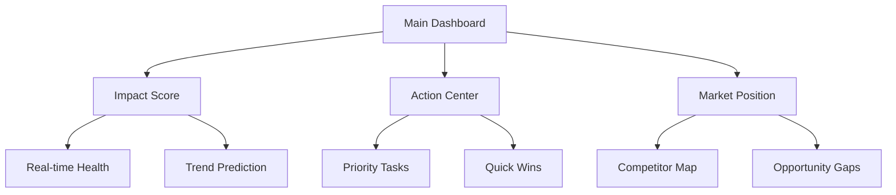
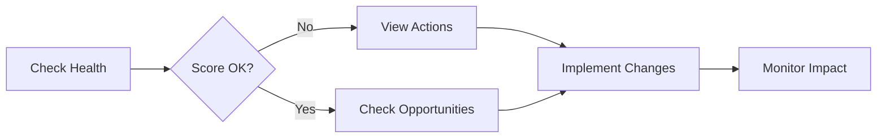
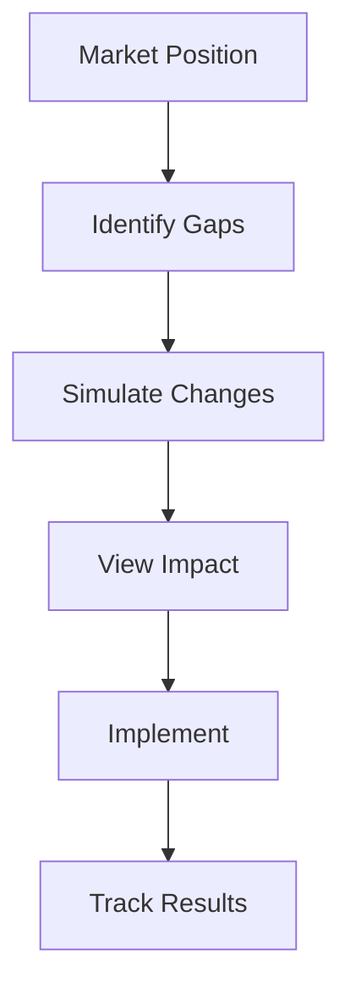
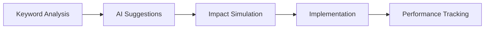

# ASO Tool UI/UX Redesign

## TLDR
- Simplified interface with focus on actions
- Real-time impact visualization
- AI-powered suggestions
- Mobile-first approach

## Key Changes

### 1. New Dashboard Layout


### 2. New Features

#### a. ASO Impact Simulator
```typescript
interface ImpactSimulation {
    changes: {
        title?: string;
        description?: string;
        keywords?: string[];
    };
    predictions: {
        ranking_change: number;
        visibility_impact: number;
        conversion_effect: number;
    };
    timeline: {
        short_term: Metrics;
        long_term: Metrics;
    };
}
```

#### b. Smart Action Center
```typescript
interface ActionItem {
    priority: 'critical' | 'high' | 'medium' | 'low';
    impact: number;
    effort: number;
    timeline: string;
    steps: {
        action: string;
        status: 'pending' | 'in_progress' | 'done';
    }[];
}
```

#### c. Visual Market Position
```typescript
interface MarketPosition {
    position: {
        x: number; // market share
        y: number; // growth rate
    };
    competitors: {
        name: string;
        position: Position;
        trend: Trend;
    }[];
    opportunities: Zone[];
}
```

## New User Flows

### 1. Daily Optimization


### 2. Competitor Analysis


### 3. Keyword Optimization


## UI Components

### 1. Impact Score Widget
```jsx
const ImpactScore = () => {
  return (
    <div className="p-6 bg-white rounded-xl shadow-lg">
      <div className="flex items-center justify-between">
        <h2 className="text-xl font-bold">ASO Impact</h2>
        <div className="text-3xl font-bold text-blue-600">
          87
        </div>
      </div>
      <div className="mt-4 space-y-3">
        {/* Trend Indicators */}
        <TrendIndicator
          label="Visibility"
          value={92}
          change={+5}
        />
        <TrendIndicator
          label="Rankings"
          value={85}
          change={-2}
        />
        <TrendIndicator
          label="Conversion"
          value={78}
          change={+3}
        />
      </div>
      {/* Quick Actions */}
      <div className="mt-6">
        <button className="w-full py-2 bg-blue-100 text-blue-700 rounded-lg">
          View Details
        </button>
      </div>
    </div>
  );
};
```

### 2. Action Center
```jsx
const ActionCenter = () => {
  return (
    <div className="p-6 bg-white rounded-xl shadow-lg">
      <div className="flex items-center justify-between mb-6">
        <h2 className="text-xl font-bold">Priority Actions</h2>
        <select className="border rounded-lg px-3 py-1">
          <option>All Tasks</option>
          <option>Quick Wins</option>
          <option>High Impact</option>
        </select>
      </div>
      <div className="space-y-4">
        {actions.map(action => (
          <ActionCard
            key={action.id}
            priority={action.priority}
            title={action.title}
            impact={action.impact}
            effort={action.effort}
            steps={action.steps}
          />
        ))}
      </div>
    </div>
  );
};
```

### 3. Market Position Map
```jsx
const MarketMap = () => {
  return (
    <div className="p-6 bg-white rounded-xl shadow-lg">
      <div className="flex items-center justify-between mb-6">
        <h2 className="text-xl font-bold">Market Position</h2>
        <div className="flex space-x-2">
          <button className="px-3 py-1 bg-blue-100 text-blue-700 rounded-lg">
            Rankings
          </button>
          <button className="px-3 py-1 bg-gray-100 text-gray-700 rounded-lg">
            Keywords
          </button>
        </div>
      </div>
      <div className="relative h-80">
        <MarketCanvas
          position={position}
          competitors={competitors}
          opportunities={opportunities}
          onZoneClick={handleZoneClick}
        />
      </div>
    </div>
  );
};
```

## Mobile Optimization

### 1. Responsive Layout
```jsx
const DashboardLayout = () => {
  return (
    <div className="grid grid-cols-1 md:grid-cols-2 lg:grid-cols-3 gap-6">
      <div className="col-span-1 md:col-span-2 lg:col-span-3">
        <ImpactScore />
      </div>
      <div className="col-span-1 md:col-span-2 lg:col-span-2">
        <ActionCenter />
      </div>
      <div className="col-span-1">
        <MarketPosition />
      </div>
    </div>
  );
};
```

### 2. Touch Interactions
```jsx
const TouchableChart = () => {
  const handleTouch = useCallback((event) => {
    const touch = event.touches[0];
    const rect = event.target.getBoundingClientRect();
    const x = touch.clientX - rect.left;
    const y = touch.clientY - rect.top;
    updateTooltip({ x, y });
  }, []);

  return (
    <div 
      onTouchStart={handleTouch}
      onTouchMove={handleTouch}
      className="touch-pan-y"
    >
      <Chart data={data} />
    </div>
  );
};
```

## Performance Optimizations

### 1. Data Loading
```jsx
const useDashboardData = () => {
  return useQuery({
    queryKey: ['dashboard'],
    queryFn: fetchDashboardData,
    staleTime: 5 * 60 * 1000, // 5 minutes
    cacheTime: 30 * 60 * 1000, // 30 minutes
  });
};
```

### 2. Rendering Optimization
```jsx
const MemoizedChart = memo(({ data }) => {
  return (
    <ResponsiveContainer>
      <LineChart data={data}>
        {/* Chart components */}
      </LineChart>
    </ResponsiveContainer>
  );
}, (prev, next) => {
  return isEqual(prev.data, next.data);
});
```

### 3. Interaction Handling
```jsx
const useThrottledUpdate = (callback, delay = 100) => {
  const throttled = useCallback(
    throttle(callback, delay),
    [callback, delay]
  );

  useEffect(() => {
    return () => {
      throttled.cancel();
    };
  }, [throttled]);

  return throttled;
};
```

## Animation & Feedback

### 1. State Transitions
```jsx
const StatusIndicator = ({ status }) => {
  return (
    <div
      className={`
        transition-all duration-300 ease-in-out
        ${status === 'success' ? 'bg-green-500' : 'bg-red-500'}
      `}
    >
      {status}
    </div>
  );
};
```

### 2. Loading States
```jsx
const LoadingState = () => {
  return (
    <div className="animate-pulse">
      <div className="h-8 bg-gray-200 rounded w-1/4 mb-4" />
      <div className="space-y-3">
        <div className="h-4 bg-gray-200 rounded" />
        <div className="h-4 bg-gray-200 rounded w-5/6" />
        <div className="h-4 bg-gray-200 rounded w-4/6" />
      </div>
    </div>
  );
};
```

## Accessibility

### 1. Keyboard Navigation
```jsx
const KeyboardNav = () => {
  const [focusIndex, setFocusIndex] = useState(0);

  const handleKeyDown = (e) => {
    switch(e.key) {
      case 'ArrowDown':
        setFocusIndex(i => Math.min(i + 1, items.length - 1));
        break;
      case 'ArrowUp':
        setFocusIndex(i => Math.max(i - 1, 0));
        break;
    }
  };

  return (
    <div role="menu" onKeyDown={handleKeyDown}>
      {items.map((item, index) => (
        <div
          role="menuitem"
          tabIndex={focusIndex === index ? 0 : -1}
          className={`focus:ring-2 focus:ring-blue-500 ${
            focusIndex === index ? 'bg-blue-50' : ''
          }`}
        >
          {item}
        </div>
      ))}
    </div>
  );
};
```

### 2. Screen Reader Support
```jsx
const AccessibleChart = ({ data }) => {
  return (
    <div>
      <div aria-hidden="true">
        <Chart data={data} />
      </div>
      <table className="sr-only">
        <caption>Ranking trends over time</caption>
        <thead>
          <tr>
            <th>Date</th>
            <th>Ranking</th>
          </tr>
        </thead>
        <tbody>
          {data.map(point => (
            <tr key={point.date}>
              <td>{point.date}</td>
              <td>{point.ranking}</td>
            </tr>
          ))}
        </tbody>
      </table>
    </div>
  );
};
```