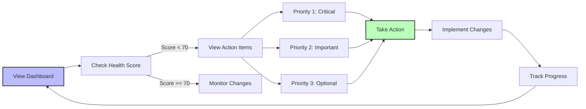
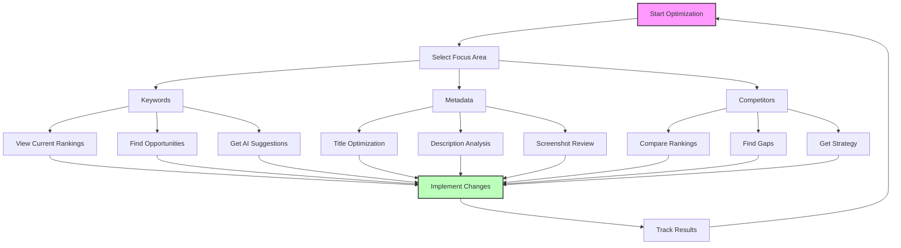
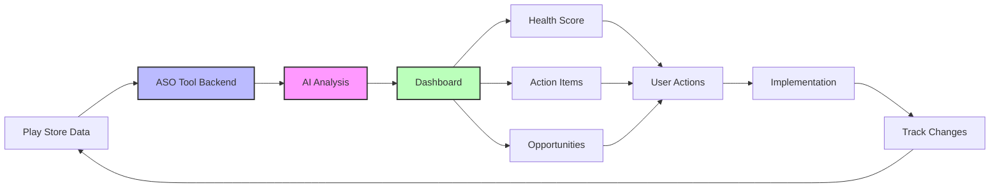
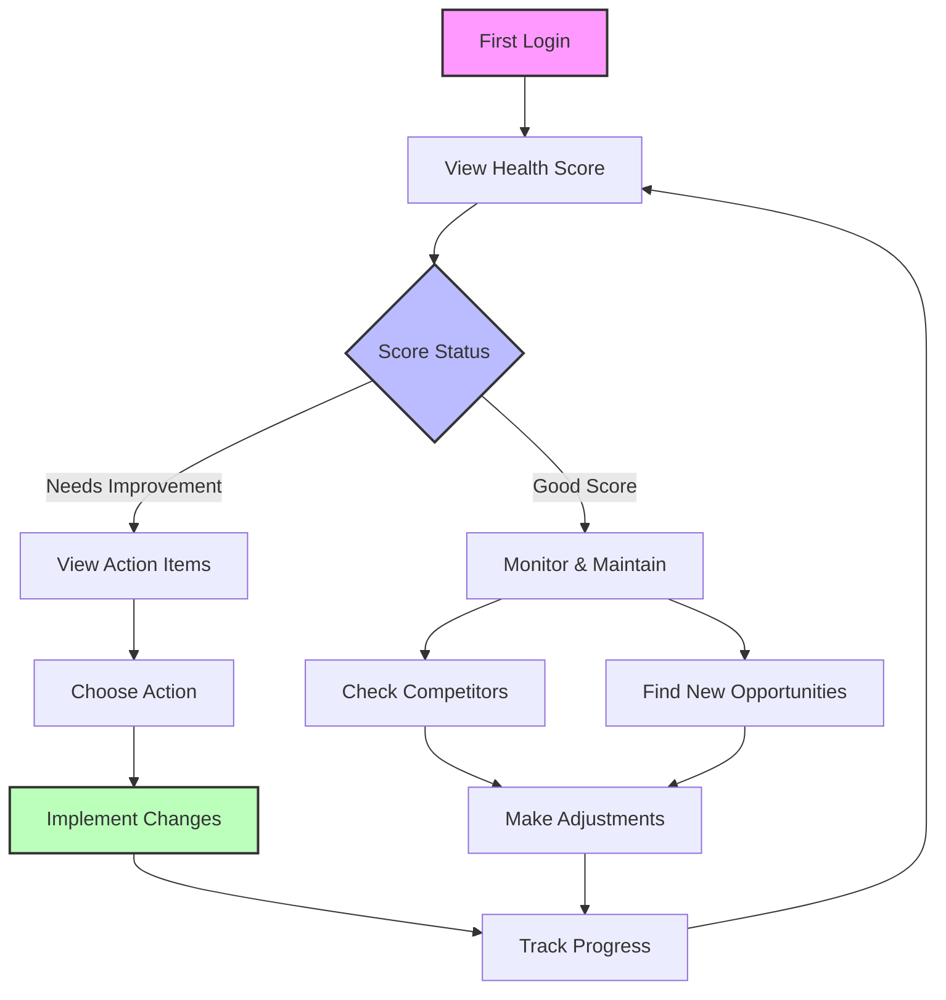

# ASO Tool Feature Flow

## 1. Main User Flow

```mermaid
graph TD
    A[User Login] --> B[Dashboard Home]
    B --> C[Health Score Widget]
    B --> D[Action Items]
    B --> E[Competitor Analysis]
    B --> F[Keyword Opportunities]
    B --> G[Metadata Health]

    %% Health Score Breakdown
    C --> C1[Overall ASO Score]
    C --> C2[Keyword Score]
    C --> C3[Metadata Score]
    C --> C4[Competitive Score]
    C --> C5[Quick Wins]

    %% Action Items Breakdown
    D --> D1[Priority Tasks]
    D --> D2[Quick Fixes]
    D --> D3[Long-term Tasks]
    D1 --> D4[Take Action]
    D2 --> D4
    D3 --> D4

    %% Competitor Analysis
    E --> E1[Ranking Comparison]
    E --> E2[Keyword Overlap]
    E --> E3[Metadata Comparison]
    E --> E4[Trend Analysis]

    %% Keyword Opportunities
    F --> F1[High Impact Keywords]
    F --> F2[Trending Keywords]
    F --> F3[Quick Win Keywords]
    F --> F4[Keyword Suggestions]

    %% Metadata Health
    G --> G1[Title Analysis]
    G --> G2[Description Analysis]
    G --> G3[Screenshot Analysis]

    style A fill:#f9f,stroke:#333,stroke-width:2px
    style B fill:#bbf,stroke:#333,stroke-width:2px
```

## 2. Action Flow

## 3. Optimization Flow

## 4. Data Flow

## 5. User Journey

## Key Features Breakdown

1. **Health Score**
   - Overall ASO health
   - Component scores
   - Trend indicators
   - Quick wins

2. **Action Items**
   - Priority tasks
   - Implementation steps
   - Progress tracking
   - Success metrics

3. **Competitor Analysis**
   - Ranking comparison
   - Keyword overlap
   - Metadata comparison
   - Market positioning

4. **Keyword Opportunities**
   - High impact suggestions
   - Trending keywords
   - Quick wins
   - Implementation guide

5. **Metadata Health**
   - Title optimization
   - Description analysis
   - Screenshot review
   - Best practices

## User Interaction Points

1. **Daily Tasks**
   - Check health score
   - View priority actions
   - Monitor rankings
   - Track changes

2. **Weekly Tasks**
   - Competitor analysis
   - Keyword research
   - Performance review
   - Strategy adjustment

3. **Monthly Tasks**
   - Trend analysis
   - Strategy review
   - Major optimizations
   - Performance reporting